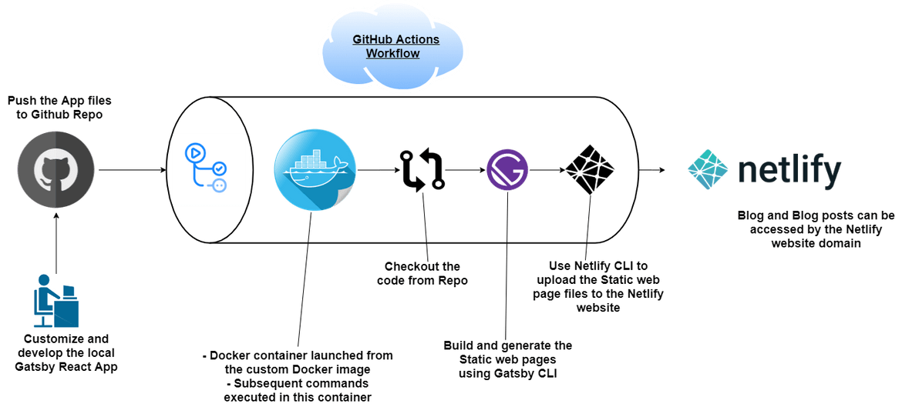

# Blog-Netlify
## Serverless Method

With this serverless method, you wont need to launch your own servers for hosting or even for the automated flow. We will implement the build automation using Github actions and deploy the website files to a Netlify website. If you don’t know about Netlify, it is a platform where static websites can be deployed easily without worrying about launching any servers. Below flow architecture can help explain the overall functionality. 
 